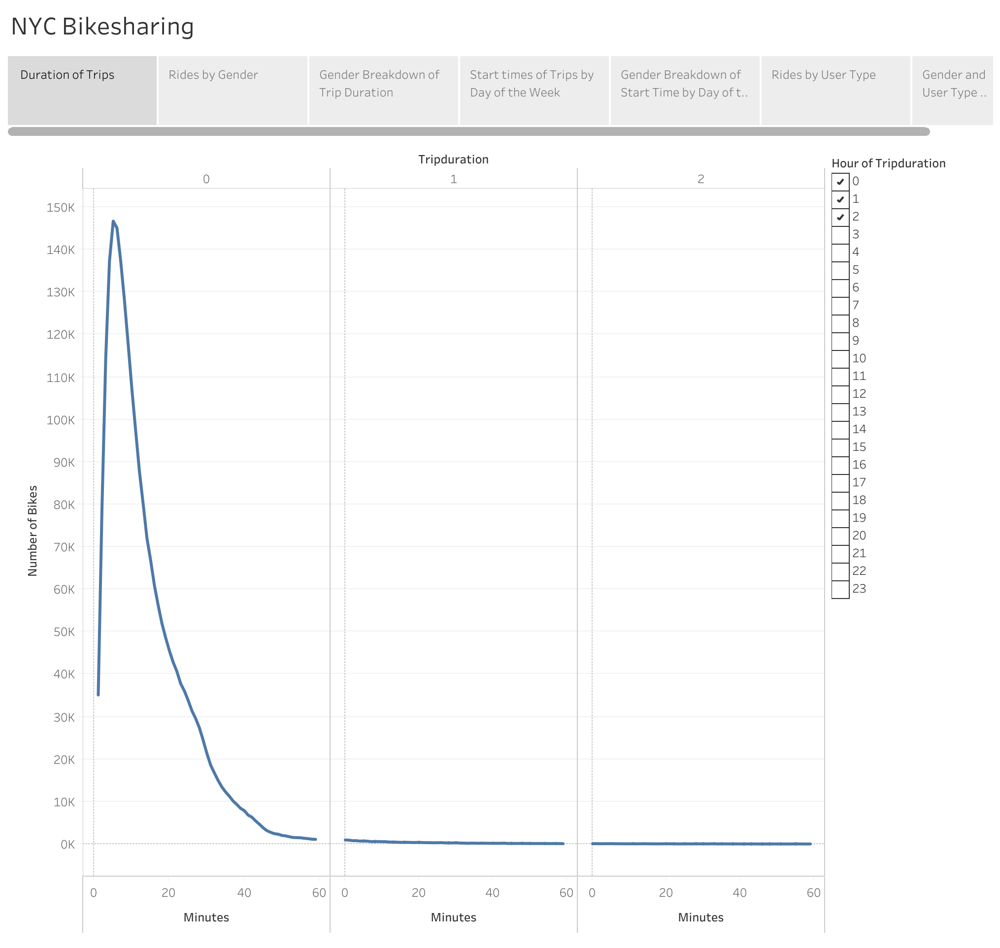
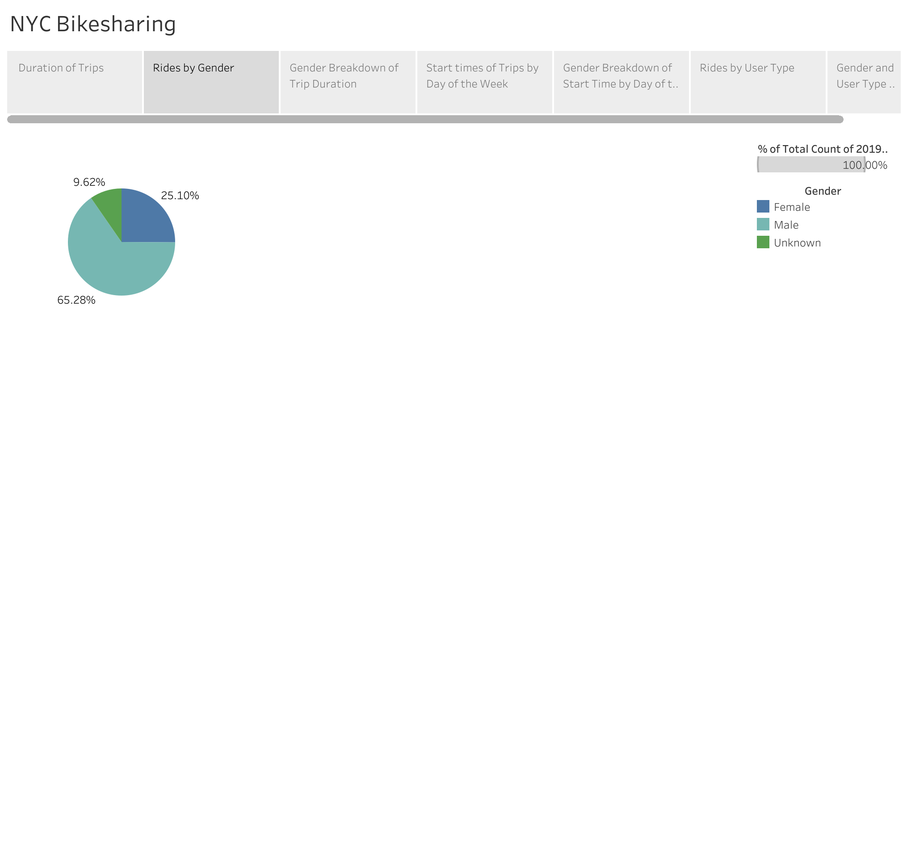
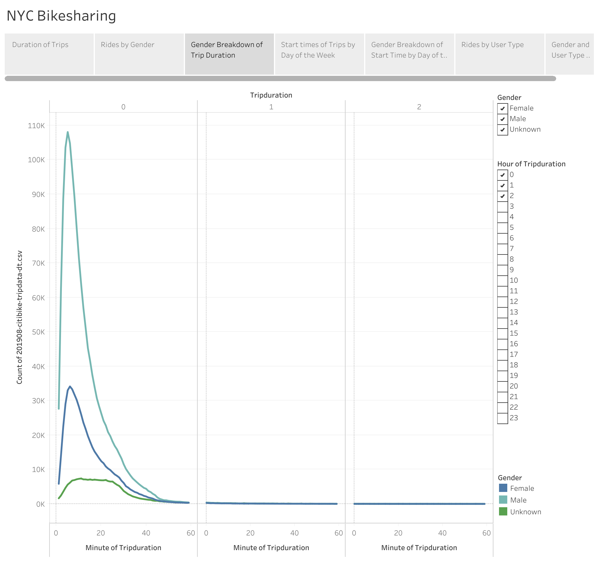
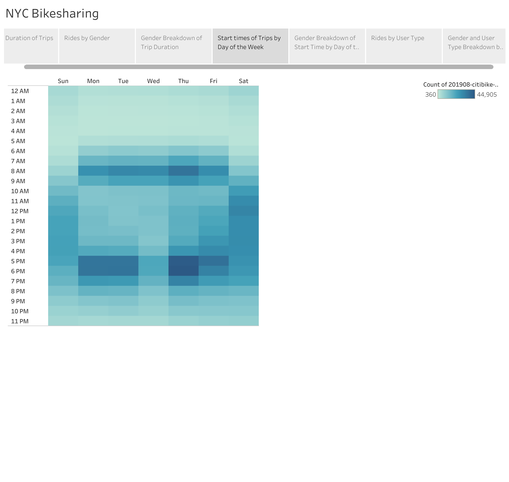
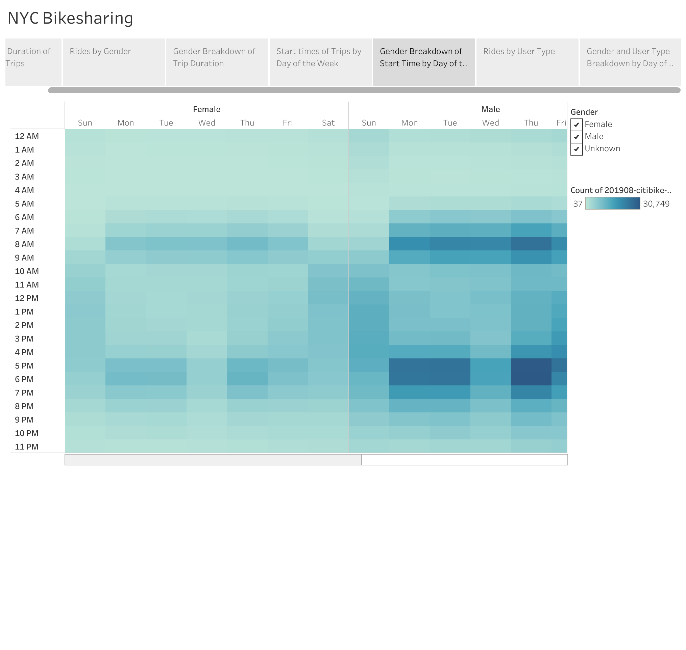
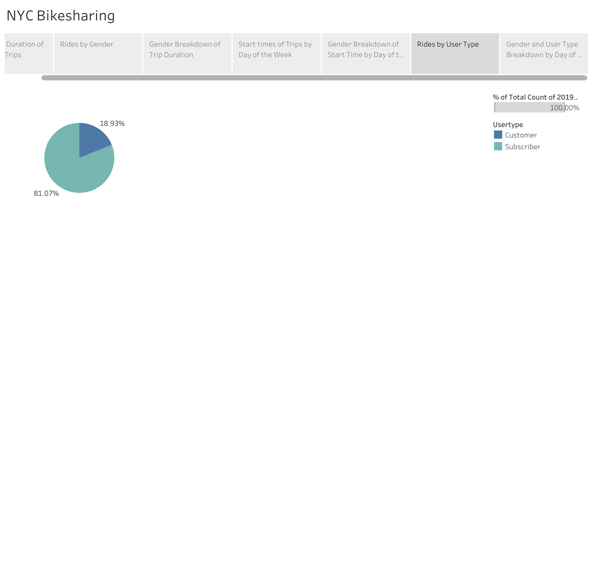
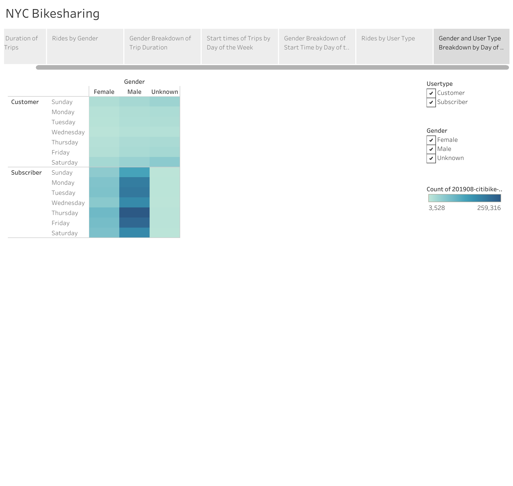

# NYC Bike Sharing Analysis

## Overview
This analysis uses data from one month of rides with a bikesharing service in New York City to provide insight which may be helpful in the design of a similar service in another location. The focus is on when and for how long users tend to use the bikes. A gender breakdown is included as a potential modifier. Also, there are two methods for users of this service. Some subscribe to the service, while others pay by the ride. 

[see Tableau story: NYC Bikesharing](https://public.tableau.com/app/profile/anna.wiste/viz/NYCBikesharing_16392737140530/NYCBikesharing)

## Results

1. Distribution of trip duration

Peak duration for trips is 5 minutes, dropping off rapidly, with few rides lasting more than an hour.

2. Breakdown of rides by gender of rider

65% of rides were by male riders, and 25% by female riders. 10% were unknown.

3. Distribution of trip duration broken down by gender of rider

The distribution of rides by males and females is similar, with a peak of 5 and 6 minutes, respectively, but proportionally, female riders had more rides of 20-30 minutes duration.

4. Heatmap showing distribution of rides by hour of the day, broken down by day of the week

Peak start times for rides fall from 6am-10am and 5-8pm pn weekdays, with rides on weekends more evenly distributed between 9am and 8pm. There is a surprising lack of rides on Wednesday afternoons.

5. Distribution of rides by hour, broken down by day of the week and gender

The pattern in start times is the same in male and female riders, including the lack of rides on Wednesday afternoon.

6. Breakdown of rides by user type: subscribers vs. customers

81% of rides were taken by subscribers to the service, with 19% as individual rides.

7. Rides by user type and gender, broken down by day of the week

Subscribers tend to ride more on weekdays (except Wednesday), though still with high numbers of rides on weekends. Customers with individual rides were comparatively evenly spread throughout the week, though there were more rides on the weekends. Patterns are the same in both male and female riders. Riders with unknown gender were much more likely to be customers rather than subscribers, and to have weekend rides. 

## Summary

